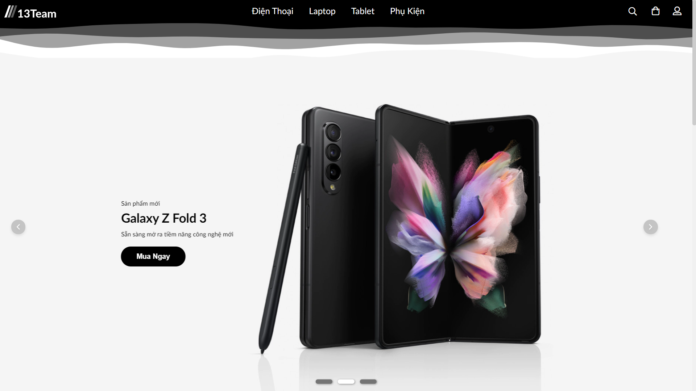

<p align="center">
  
</p>

<div align="center"> An basic E-commerce website</div>

## 📜 Table of content<!-- omit in toc -->

- [🎉 About our Project](#-about-our-project)
- [✨ Feature](#-feature)
- [🔨 Build With](#-build-with)
- [📦 Getting Started](#-getting-started)
  - [Prerequisites](#prerequisites)
  - [Installation](#installation)
- [📃 License](#-license)
- [❤️ Acknowledgments](#️-acknowledgments)

## 🎉 About our Project

**13Team** is a e-commerce website selling tech products like smartphones, tablets,...This it our team website to show what we have learned over a semester of **Internet and Web Technology**.

_It was name after our own team number designation because naming stuffs is hard._

<p align="right">(<a href="#top">back to top</a>)</p>

## ✨ Feature

**13Team** has the basic features of any e-commerce website included but not limited to:

- A basic authentication system.
- Each item has it own page to show detail information and similar products.
- A search feature ables to search up different or specific types of product.
- Ability to add items to cart and checkout cart's content.
- A purchase history page to view past order.

<p align="right">(<a href="#top">back to top</a>)</p>

## 🔨 Build With

- [Handlebars](https://handlebarsjs.com/) for rendering website.
- [MongoDb](https://www.mongodb.com/) for database.
- [Express](https://expressjs.com/) framework.
- [NodeJS](https://nodejs.org/en/) dependencies:
  - [express-handlebars](https://www.npmjs.com/package/express-handlebars) Handlebars view engine for Express.
  - [cookie-parser](https://www.npmjs.com/package/cookie-parser), [cookie-session](https://www.npmjs.com/package/cookie-session) create cookies for authentication.
  - [express-session](https://www.npmjs.com/package/express-session) session middleware for Express.
  - [method-override](https://www.npmjs.com/package/method-override) add the ability to use HTTP verbs like PUT, DELETE,...
  - [nodemailer](https://www.npmjs.com/package/nodemailer) for sending email.
  - [mongoose](https://mongoosejs.com/) for interacting with MongoDB.

<p align="right">(<a href="#top">back to top</a>)</p>

## 📦 Getting Started

To get a local copy up and running follow these simple example steps.

### Prerequisites

- Make sure you have installed [MongoDB](https://www.mongodb.com/) and [NodeJS](https://nodejs.org/en/).

- Update to the lastest version of npm

  ```sh
    npm install npm@latest -g
  ```

- Get the demo database:

### Installation

1. Clone the repo

   ```sh
   git clone https://github.com/nhutpro/Website-Project.git
   cd Website-project
   ```

2. Install NPM packages

   ```sh
   npm install
   ```

3. Start the website

   ```sh
   npm start
   ```

<p align="right">(<a href="#top">back to top</a>)</p>

## 📃 License

Distributed under the MIT License. See `LICENSE.txt` for more information.

<p align="right">(<a href="#top">back to top</a>)</p>

## ❤️ Acknowledgments

List of resources use in this project

- [Font Awesome](https://fontawesome.com)
- [GlideJS](https://glidejs.com/), [Swiper](https://swiperjs.com/)
- [AOS](https://michalsnik.github.io/aos/)

<p align="right">(<a href="#top">back to top</a>)</p>
